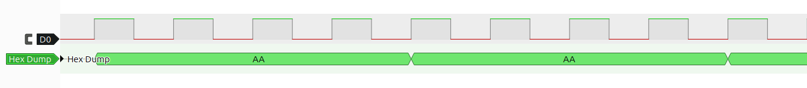

# hexDumpDecoder
Simple sigrok decoder to read a digital signal as hex string. I used it to replay a 433 MHz signal, sampling the data from a 433MHz receiver with my digital analyzer and replaying it with an ESP32 and 433 MHz transmitter. Those signals can be pretty long, and noting down bit by bit can be frustrating.

## How to use
Set env. var. SIGROKDECODE_DIR to point to this decoder's directory, export it and start pulseview. This decoder should appear in the list of the decoders. For more information see [sigrok wiki](https://sigrok.org/wiki/Protocol_decoder_HOWTO).
